# Architecture — Post-Refactoring (Phases 1–7 Complete)

## 1. Architecture Diagram

```mermaid
graph TB
    subgraph "API Layer (FastAPI Routes)"
        R_UPLOAD[upload.py]
        R_BATCH[batch.py]
        R_DOCS[documents.py]
        R_CAND[candidates.py]
        R_PROC[processing.py]
        R_REVIEW[review_queue.py]
        R_DASH[dashboard.py]
        R_WS[ws.py]
        R_AUTH[auth.py]
        R_SETTINGS[settings.py]
        R_HEALTH[health.py]
    end

    subgraph "Task Management"
        TM[TaskManager<br/>Semaphore-based concurrency]
    end

    subgraph "Services Layer"
        subgraph "Processing Pipeline (Staged)"
            PIPELINE[ProcessingPipeline<br/>thin orchestrator]
            STAGE_NORM[NormalizationStage]
            STAGE_OCR[OCRStage]
            STAGE_CLASS[ClassificationStage]
            STAGE_VAL[ValidationStage]
            STAGE_STATUS[StatusStage]
        end
        subgraph "Batch (Decomposed)"
            ORCH[BatchOrchestrator<br/>thin coordinator]
            DISC_SVC[DiscoveryService]
            INGEST_SVC[DocumentIngestService]
            STATUS_SVC[BatchStatusService]
            PROGRESS_SVC[ProgressService]
            RETRY_SVC[RetryService]
        end
        subgraph "OCR"
            OCR_ENGINE[PaddleOCREngine]
            OCR_PREPROC[DocumentPreprocessor]
            OCR_CONF[OCRConfidenceEvaluator]
        end
        subgraph "AI"
            AI_CLASS[AIClassifier<br/>injectable OllamaClient]
            OLLAMA[OllamaClient<br/>tenacity retry]
            PROMPTS[prompts.py]
        end
        subgraph "Validation"
            OWN_VAL[OwnershipValidator]
            MATCHER[matcher.py]
        end
        subgraph "Processing Helpers"
            NORMALIZER[DocumentNormalizer]
            SPLITTER[DocumentSplitter]
        end
        subgraph "Notifications"
            NOTIF[NotificationService]
        end
        subgraph "WebSocket"
            WS_HUB[WebSocketHub<br/>singleton: ws_hub]
        end
        subgraph "Audit"
            AUDIT[AuditService]
        end
        subgraph "Integrations"
            GMAIL[GmailScanner]
            DRIVE[GoogleDriveService]
        end
    end

    subgraph "Core"
        CONFIG[Settings<br/>pydantic-settings<br/>env-overridable]
        EXCEPTIONS[Domain Exceptions<br/>12 typed errors]
        LOGGING[Structured Logging<br/>structlog]
    end

    subgraph "Data Layer"
        DB_SESSION[AsyncSessionLocal<br/>SQLAlchemy Async]
        MODELS[(20 SQLAlchemy Models)]
    end

    subgraph "External Systems"
        OLLAMA_SRV[Ollama LLM Server]
        POSTGRES[(PostgreSQL)]
        GOOGLE[Google APIs<br/>Gmail + Drive]
    end

    %% Routes → TaskManager → Services
    R_UPLOAD --> TM
    R_BATCH --> TM
    R_REVIEW --> TM
    TM --> PIPELINE
    TM --> ORCH
    TM --> NOTIF

    %% Pipeline stages
    PIPELINE --> STAGE_NORM
    PIPELINE --> STAGE_OCR
    PIPELINE --> STAGE_CLASS
    PIPELINE --> STAGE_VAL
    PIPELINE --> STAGE_STATUS

    %% Batch decomposition
    ORCH --> DISC_SVC
    ORCH --> INGEST_SVC
    ORCH --> STATUS_SVC
    ORCH --> PROGRESS_SVC
    ORCH --> PIPELINE

    %% DI: OCR/AI/Validation injected into stages
    STAGE_OCR --> OCR_ENGINE
    STAGE_CLASS --> AI_CLASS
    STAGE_VAL --> OWN_VAL
    AI_CLASS --> OLLAMA
    OLLAMA --> OLLAMA_SRV

    %% Config feeds services
    CONFIG --> TM
    CONFIG --> OLLAMA
    CONFIG --> NOTIF
    CONFIG --> DISC_SVC
    CONFIG --> INGEST_SVC

    %% DB access
    DB_SESSION --> POSTGRES
```



---

## 2. Refactoring Phases Completed

| Phase | Description | Key Changes |
|-------|-------------|-------------|
| **0** | Architecture Analysis | Documented god classes, dependency map, risks |
| **1** | Dependency Injection | `ProcessingPipeline`, `BatchOrchestrator`, `AIClassifier` accept injected deps; factory functions for DI |
| **2** | Pipeline Decomposition | Split 620-LOC god class into 5 focused stages under `services/processing/stages/` |
| **3** | Batch Decomposition | Split 900-LOC god class into 5 focused services under `services/batch/` |
| **4** | Error Handling | Domain exception hierarchy (12 typed exceptions), safety-net middleware, structured error responses |
| **5** | Async Task Management | Centralized `TaskManager` with per-type semaphores, graceful shutdown, cancellation |
| **6** | Configuration Management | 15+ operational params moved from hardcoded → `Settings` (env-overridable) |
| **7** | Testing Infrastructure | Auth fixtures, `authenticated_client`, factory fixtures, 12 integration tests; 162 total tests passing |

---

## 3. Key Design Decisions

### Dependency Injection (Phase 1)
- **Pattern**: Constructor injection with defaults for backward compatibility
- **Singletons**: OCR engine, AI classifier, WebSocket hub managed as module-level instances
- **Factory functions**: `get_processing_pipeline()`, `get_batch_orchestrator()` for route-level DI

### Pipeline Stages (Phase 2)
- **Pattern**: Each stage is a class with a `run(document_id, db)` method
- **Stages**: Normalization → OCR → Classification → Validation → Status
- **Orchestrator**: `ProcessingPipeline.process_document()` calls stages sequentially

### Task Management (Phase 5)
- **Pattern**: Module-level singleton `task_manager` with `submit(coro, task_type, name)`
- **Concurrency**: Per-type semaphores (document=4, batch=2, notification=4)
- **Shutdown**: `task_manager.shutdown(timeout)` called in app lifespan cleanup
- **Rejection**: New tasks rejected once shutdown begins

### Configuration (Phase 6)
- **Pattern**: Single `Settings` class with `pydantic-settings`, reads `.env` + environment
- **Validation**: Required fields enforced in production, safe defaults in development
- **All operational params**: Timeouts, concurrency limits, pool sizes, retry counts are configurable

### Error Handling (Phase 4)
- **Pattern**: Domain exceptions with `status_code` class attribute
- **Middleware**: Safety-net HTTP middleware catches unhandled exceptions, returns 500 with correlation ID
- **No exception swallowing**: Background tasks log errors via TaskManager callback

---

## 4. File Structure (Current)

```
backend/app/
├── main.py                              (App setup, lifespan, middleware, routers)
├── __init__.py
├── api/
│   ├── deps.py                          (get_current_user, get_db)
│   ├── utils.py                         (parse_date_param)
│   └── routes/
│       ├── auth.py                      (OAuth2 login/callback/logout)
│       ├── batch.py                     (Batch upload/start/list/retry → TaskManager)
│       ├── candidates.py                (CRUD)
│       ├── dashboard.py                 (Stats aggregation, cached)
│       ├── documents.py                 (List/detail with enrichment)
│       ├── health.py                    (Health + Ollama check)
│       ├── processing.py               (Timeline, batches, audit logs)
│       ├── review_queue.py             (Review queue + notifications → TaskManager)
│       ├── settings.py                  (Integration config, rules)
│       ├── upload.py                    (File upload + TaskManager submit)
│       └── ws.py                        (WebSocket endpoint)
├── core/
│   ├── config.py                        (Pydantic Settings — all operational params)
│   ├── exceptions.py                    (12 domain exceptions)
│   ├── logging.py                       (Structured logging setup)
│   └── security.py                      (File validation, sanitization)
├── db/
│   ├── base.py                          (Base model)
│   └── session.py                       (Engine + session factory)
├── models/                              (20 SQLAlchemy models)
├── schemas/                             (Pydantic response/request schemas)
└── services/
    ├── task_manager.py                  (TaskManager — centralized async task mgmt)
    ├── ai/
    │   ├── classifier.py                (AIClassifier — injectable)
    │   ├── ollama_client.py             (HTTP client, retry, configurable params)
    │   └── prompts.py                   (Prompt templates)
    ├── audit/
    │   └── logger.py                    (AuditService)
    ├── batch/
    │   ├── orchestrator.py              (Thin coordinator)
    │   ├── discovery_service.py         (Gmail/Drive document discovery)
    │   ├── ingest_service.py            (Download + save documents)
    │   ├── status_service.py            (Batch status computation)
    │   ├── progress_service.py          (WS broadcast + batch logging)
    │   ├── retry_service.py             (Single-candidate retry)
    │   └── parser.py                    (Excel/CSV parser)
    ├── integrations/
    │   ├── drive_service.py             (Google Drive API)
    │   └── gmail_scanner.py             (Gmail API)
    ├── notifications/
    │   └── email_service.py             (NotificationService — configurable retries)
    ├── ocr/
    │   ├── confidence.py                (OCRConfidenceEvaluator)
    │   ├── engine.py                    (PaddleOCREngine)
    │   └── preprocessor.py              (DocumentPreprocessor)
    ├── processing/
    │   ├── pipeline.py                  (Thin orchestrator — DI-enabled)
    │   ├── normalizer.py                (DocumentNormalizer)
    │   ├── splitter.py                  (DocumentSplitter)
    │   └── stages/
    │       ├── __init__.py
    │       ├── normalization_stage.py
    │       ├── ocr_stage.py
    │       ├── classification_stage.py
    │       ├── validation_stage.py
    │       └── status_stage.py
    ├── settings/
    │   └── file_naming_service.py       (FileNamingRuleService)
    ├── validation/
    │   ├── matcher.py                   (Name/DOB/Gender matchers)
    │   └── ownership.py                 (OwnershipValidator)
    └── websocket/
        └── hub.py                       (WebSocketHub singleton)
```

---

## 5. Test Coverage

| Test File | Tests | Coverage Area |
|-----------|-------|---------------|
| `test_dependency_injection.py` | 22 | DI factories, injected deps used correctly |
| `test_pipeline_stages.py` | 12 | Each pipeline stage in isolation |
| `test_batch_services.py` | 20 | Batch sub-services (discovery, ingest, status, progress) |
| `test_error_handling.py` | 34 | Exception hierarchy, middleware, structured responses |
| `test_task_manager.py` | 14 | Submit, concurrency, shutdown, cancel, status |
| `test_config_management.py` | 23 | Defaults, overrides, validation, properties |
| `test_integration.py` | 12 | Upload flow, auth enforcement, dashboard, limits |
| `test_candidates.py` | 7 | Candidate CRUD endpoints |
| `test_documents.py` | 11 | Document listing, processing timeline, audit logs |
| `test_upload.py` | 5 | Upload endpoint (file validation, metadata) |
| `test_health.py` | 2 | Health endpoint |
| **Total** | **162** | |

### Running Tests
```bash
cd backend
.\.venv\Scripts\python.exe -m pytest tests/ --ignore=tests/test_e2e.py -v
```

---

## 6. Configuration Reference

All settings are env-overridable. Set via `.env` file or environment variables.

| Setting | Default | Description |
|---------|---------|-------------|
| `ENVIRONMENT` | `development` | `development` / `production` |
| `DATABASE_URL` | (auto in dev) | PostgreSQL async connection string |
| `SECRET_KEY` | (auto in dev) | Session signing key |
| `OLLAMA_BASE_URL` | `http://localhost:11434` | Ollama server URL |
| `OLLAMA_MODEL` | `llama3.1:latest` | AI model name |
| `OLLAMA_CONNECT_TIMEOUT` | `10.0` | Ollama connection timeout (seconds) |
| `OLLAMA_MAX_RETRIES` | `3` | Ollama request retry count |
| `OLLAMA_NUM_PREDICT` | `1024` | Max tokens per AI response |
| `OLLAMA_NUM_CTX` | `4096` | AI context window size |
| `MAX_FILES_PER_UPLOAD` | `20` | Max files in single upload |
| `MAX_UPLOAD_SIZE_MB` | `50` | Max file size |
| `MAX_DOCUMENT_CONCURRENCY` | `4` | Parallel document processing tasks |
| `MAX_BATCH_CONCURRENCY` | `2` | Parallel batch processing tasks |
| `MAX_NOTIFICATION_CONCURRENCY` | `4` | Parallel notification tasks |
| `SHUTDOWN_TIMEOUT_SECONDS` | `30` | Graceful shutdown drain timeout |
| `EMAIL_MAX_RETRIES` | `3` | Email send retry count |
| `STUCK_NOTIFICATION_MAX_AGE_MINUTES` | `30` | Stuck notification recovery threshold |
| `GOOGLE_IO_POOL_SIZE` | `4` | Thread pool for Google API I/O |
| `WS_TICKET_TTL_SECONDS` | `30` | WebSocket ticket lifetime |
| `DASHBOARD_CACHE_TTL_SECONDS` | `30` | Dashboard stats cache duration |
| `CORS_ORIGINS` | `http://localhost:3000,...` | Allowed CORS origins |
